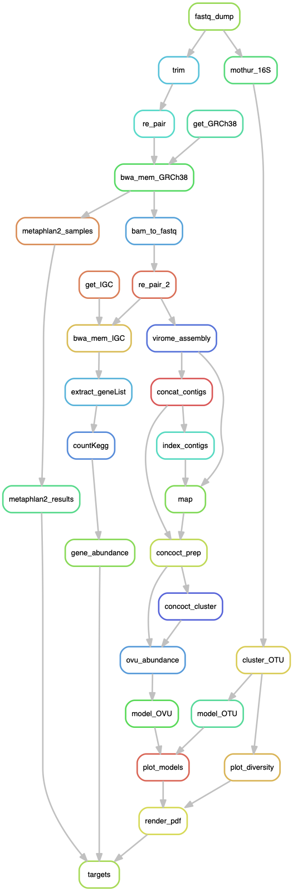

# bioinf545-group3-project

Group members:

- Nicole Bowers
- [Kelly L. Sovacool](github.com/kelly-sovacool)
- Christina Kang-Yun
- Brittany Hicks

## Setup

Most dependencies are listed in the [conda](https://conda.io/docs/) environment file. If you don't already have conda, I recommend installing the [Miniconda](https://conda.io/miniconda.html) Python 3 distribution.

You can create the conda environment with:
```bash
conda env create -f environment.yml
```

Then activate it with:
```bash
conda activate bf545
```

Additionally, you will need to [install a TeX distribution](https://nbconvert.readthedocs.io/en/latest/install.html#installing-tex) to compile the documents to PDF.

As new dependencies are added, they should be added to the [environment file](environment.yml).

## Usage

Run the [snakemake](https://snakemake.readthedocs.io/en/stable/) workflow with:
```bash
snakemake
```

Visualize the workflow with:
```bash
snakemake --rulegraph | dot -T png > figures/rulegraph.png
```


See the rendered PDF and HTML files [here](https://sovacool.dev/bioinf545-group3-project).

